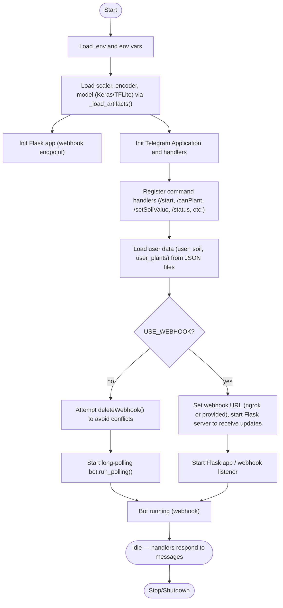

# Flowchart for `main.py`

This file shows the high level flow of `main.py` (Telegram bot + model loading + optional Flask webhook). Render the diagram block using a Mermaid previewer (VS Code Mermaid plugin) or an online Mermaid renderer.

Notes:
- Handlers call helper functions: `predict_crop()`, `suitability_check()`, and file I/O helpers `load_user_*` and `save_user_*`.
- The file also contains CLI/control logic to choose webhook vs polling and to try fallback dashboard endpoints when handling `/status`.
