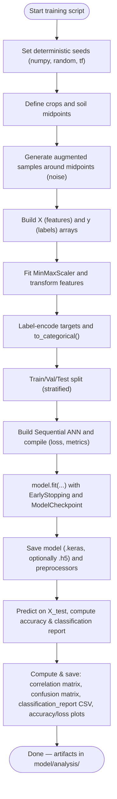

# Flowchart for `model_training.py`

Mermaid diagram describing data generation, training, evaluation, and analysis artifact creation.

Notes:
- Training history (`history.history`) is used to plot Accuracy vs Epoch and Loss vs Epoch.
- Analysis artifacts are written to `model/analysis/`:
  - `correlation_matrix.csv` / `.png`
  - `confusion_matrix.csv` / `.png`
  - `classification_report.csv`
  - `accuracy_loss.png`
  - `performance_report.md`
