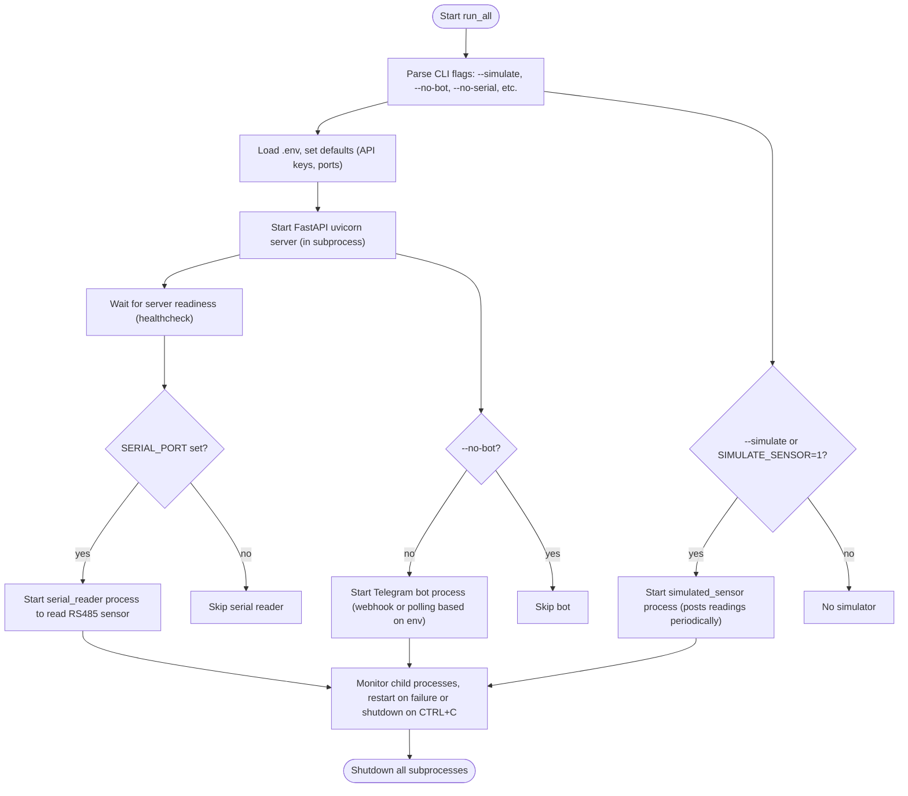

# Flowchart for `run_all.py`

High-level flow: orchestrates backend, simulator/serial bridge, and bot processes with flags.

Notes:
- `run_all.py` ensures ordering: server must be ready before simulator/serial/bot start.
- It accepts env overrides and flags to control which components to run.
- Useful improvements: add health endpoints and exponential backoff for restarts.
